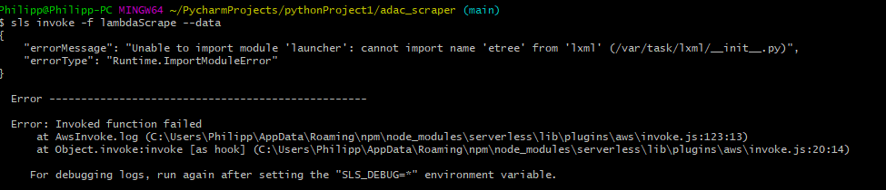

### The Struggles of Serverless

This is the update to the previous blog entry i did. Followed by the updated code in the DS Adac_Scraper folder. 
I didn't include this part because it`s only half functional. My plan was to scrape the data and then upload the scraped data to an S3 Bucket on AWS, and this should all be automated.

The scraping took a while to work, but i managed to do it, and turned my head to the next step, automatisation and storing of the data. I followed the steps in the workshop and came to my first problmes. I wasn't able to invoke my functions with serverless.
I searched around on stackoverflow, git hub and everything else the internet offers. I contacted our team mentor Sara and Daniel. Daniel told me not to worry about it too much and just continue with the other stuff.
And that's what i did, after a while, and some more help of Daniel i managed to store my data in and S3 Bucket so that my WebDev people can access it and use it for our project. 
Then i wondered why the automatisation wasn't working, i looked at the code for hours, tried to find a solution on the web but everthing i tried failed. I visited some webdev office hours, where i sat on the problem with Daniel. We figured out what the problem is.

The biggest enemie i faced in my techlabs journey. "Unable to import module 'launcher': cannot import name 'etree' from 'lxml'"- This errorline gave me nightmares, i read about it on all the known parts of the internet. Either the bugfixes they had where not working for me, or i wasn't able to understand a thing about what they wrote.
After hours of looking at the same lines of code, and trying to fix it with diffrent approaches, i joined the WebDev offcie hour call, where Daniel and i sat on the problem for another hour and 15 min. We were not able to solve the problem. So i faced the reality, i can upload and store the code. But i can't automated it in the given time and with my knowledge. 

That's the failing story of my attempt to automate my scraping
